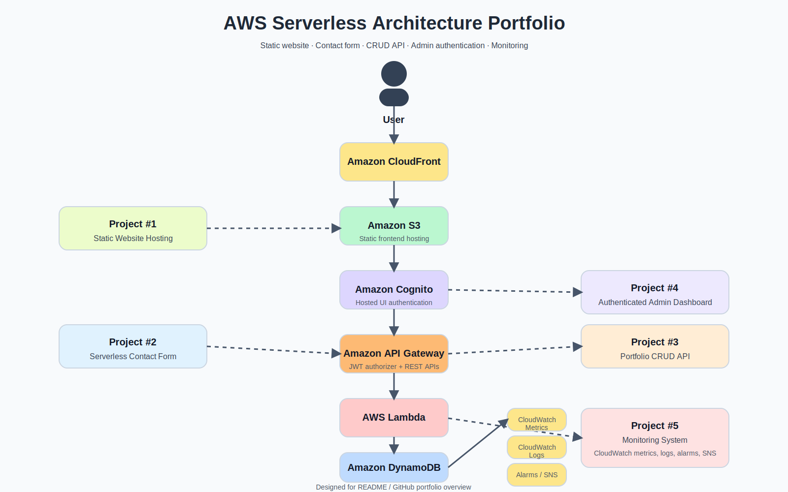

# AWS Serverless Architecture Portfolio

Yusuke Emata

# Portfolio Website

Live site  
https://yusuke-cloud.org

Admin dashboard  
https://yusuke-cloud.org/admin.html

---

This repository contains hands-on AWS projects implementing real serverless architecture patterns on AWS.

The goal of this portfolio is to demonstrate practical cloud architecture including:

* serverless application design
* secure authentication
* REST API architecture
* NoSQL data storage
* monitoring and observability

These projects showcase end-to-end AWS system design using modern serverless services.

---

# Architecture Diagram



# Architecture Overview

This portfolio demonstrates a fully serverless architecture built on AWS.

Main AWS services used:

* Amazon S3 — Static frontend hosting
* Amazon CloudFront — Global CDN
* Amazon Cognito — Authentication
* Amazon API Gateway — Secure API layer
* AWS Lambda — Serverless compute
* Amazon DynamoDB — NoSQL database
* Amazon CloudWatch — Monitoring
* Amazon SNS — Alert notifications

Architecture flow:

```
User
  │
  ▼
CloudFront
  │
  ▼
S3 (Static Frontend)
  │
  ▼
Amazon Cognito Authentication
  │
  ▼
API Gateway (JWT Authorizer)
  │
  ▼
Lambda
  │
  ▼
DynamoDB
```

Monitoring layer:

```
Lambda / API Gateway / DynamoDB
          │
          ▼
   CloudWatch Metrics
          │
          ▼
     CloudWatch Logs
          │
          ▼
     CloudWatch Alarms
          │
          ▼
        SNS Notifications
```

---

# Portfolio Projects

## Project #1 — Static Website Hosting

A globally distributed static website hosted on AWS.

Services used:

* Amazon S3
* Amazon CloudFront
* Amazon Route 53
* AWS Certificate Manager (ACM)

Key concepts demonstrated:

* Static site hosting
* CDN distribution
* HTTPS configuration
* Custom domain setup

Architecture:

```
User
  │
  ▼
CloudFront
  │
  ▼
S3 Static Website
  │
  ▼
Route53 + ACM
```
Why this architecture:

S3 provides highly durable and scalable object storage for static content.  
CloudFront is used to distribute the website globally with low latency and HTTPS support.  
Route 53 manages the custom domain and routes traffic to the CloudFront distribution.

---

## Project #2 — Serverless Contact Form

A contact form implemented using a serverless backend.

Services used:

* Amazon API Gateway
* AWS Lambda
* Amazon SES
* Amazon CloudFront

Key concepts demonstrated:

* API design
* Serverless backend
* Event-driven email workflow
* Frontend ↔ backend integration

Architecture:

```
User
  │
  ▼
CloudFront
  │
  ▼
API Gateway
  │
  ▼
Lambda
  │
  ▼
Amazon SES
```

Why this architecture:

API Gateway provides a managed API endpoint for receiving form submissions.  
Lambda processes incoming requests without requiring server management.  
SES handles reliable email delivery with minimal operational overhead.

---

## Project #3 — Portfolio CRUD API

A serverless backend API for managing portfolio data.

Services used:

* Amazon API Gateway
* AWS Lambda
* Amazon DynamoDB

Key concepts demonstrated:

* REST API design
* CRUD operations
* NoSQL data modeling
* Serverless backend architecture

Architecture:

```
Client
  │
  ▼
API Gateway
  │
  ▼
Lambda
  │
  ▼
DynamoDB
```
Why this architecture:

API Gateway exposes a REST API endpoint.  
Lambda functions implement the application logic.  
DynamoDB stores portfolio data with low latency and automatic scaling.

---

## Project #4 — Authenticated Admin Dashboard

A secure admin dashboard that allows authenticated users to manage portfolio items.

Services used:

* Amazon Cognito (Hosted UI authentication)
* Amazon API Gateway (JWT Authorizer)
* AWS Lambda
* Amazon DynamoDB
* Amazon S3
* Amazon CloudFront

Key features:

* Cognito Hosted UI login
* JWT-based authentication
* Secure API authorization
* Protected CRUD operations
* Logout functionality

Security flow:

1. User logs in through Cognito Hosted UI
2. Cognito issues a JWT access token
3. Frontend includes the token in API requests
4. API Gateway validates the JWT token
5. Authorized requests are forwarded to Lambda

Unauthorized requests are blocked by API Gateway authorization.

Architecture:

```
Admin User
    │
    ▼
CloudFront
    │
    ▼
S3 Admin UI
    │
    ▼
Cognito Hosted UI
    │
    ▼
API Gateway (JWT Authorizer)
    │
    ▼
Lambda
    │
    ▼
DynamoDB
```
Why this architecture:

Cognito provides managed authentication without implementing a custom login system.  
API Gateway JWT authorizers enforce secure API access.  
Lambda and DynamoDB enable a fully serverless backend.

---

## Project #5 — Serverless Monitoring System

## Project #5 — Serverless Monitoring System

A monitoring and alerting system for the serverless architecture using Amazon CloudWatch and Amazon SNS.

This project adds observability to the portfolio architecture by monitoring
Lambda, API Gateway, and DynamoDB workloads.

Services used:

* Amazon CloudWatch Metrics
* Amazon CloudWatch Logs
* Amazon CloudWatch Alarms
* Amazon SNS

Monitoring features:

* API Gateway request monitoring
* Lambda execution metrics
* Log aggregation and analysis
* CloudWatch alarms for abnormal behavior
* SNS notifications for alerts

Example monitoring rules:

• Lambda Errors >= 1 within 5 minutes  
• API Gateway 5XX errors >= 1  
• DynamoDB WriteThrottleEvents >= 1

Architecture:

```
Lambda / API Gateway / DynamoDB
          │
          ▼
   CloudWatch Metrics
          │
          ▼
     CloudWatch Logs
          │
          ▼
     CloudWatch Alarms
          │
          ▼
        SNS Alerts
```
Why this architecture:

CloudWatch provides centralized monitoring for serverless workloads.  
Metrics and logs allow visibility into system behavior.  
CloudWatch alarms detect abnormal patterns and trigger SNS notifications.

---

# Technologies Used

AWS Services

* Amazon S3
* Amazon CloudFront
* Amazon Cognito
* Amazon API Gateway
* AWS Lambda
* Amazon DynamoDB
* Amazon CloudWatch
* Amazon SNS
* Amazon SES

Languages / Tools

* JavaScript
* HTML / CSS
* Serverless architecture patterns

---

# Key Concepts Demonstrated

This portfolio highlights several important AWS architecture concepts:

* Serverless architecture design
* Secure authentication with Cognito
* JWT authorization with API Gateway
* REST API design
* NoSQL database integration
* Cloud monitoring and observability
* Secure API access patterns
* End-to-end AWS system integration

---

# Author

Yusuke Emata

AWS Certified Solutions Architect – Associate, 
PMP / PMI-ACP Certified Project Manager

Focused on designing and implementing serverless architectures on AWS, combining cloud engineering with strong project management experience.

---

# Portfolio Website

Live site:

https://yusuke-cloud.org
