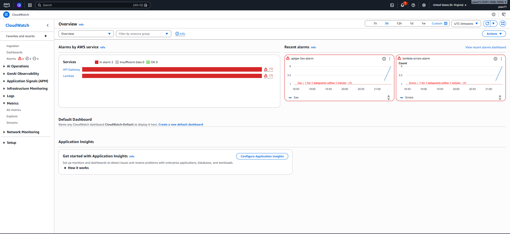
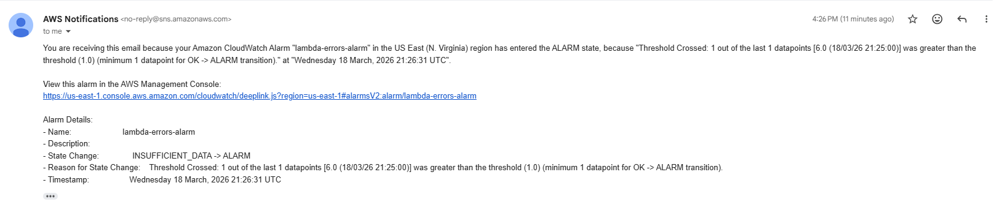

# AWS Serverless Architecture Portfolio

Serverless portfolio demonstrating end-to-end AWS architecture, including authentication, API design, database integration, and monitoring.

Yusuke Emata

---

## Live Demo

Main site  
https://yusuke-cloud.org

Live projects (public CRUD demo)  
https://yusuke-cloud.org/projects.html

Contact form  
https://yusuke-cloud.org/contact.html

Admin dashboard (authentication required)  
https://yusuke-cloud.org/admin.html

---

This repository contains hands-on AWS projects implementing real serverless architecture patterns on AWS.

The goal of this portfolio is to demonstrate practical cloud architecture including:

* serverless application design
* secure authentication
* REST API architecture
* NoSQL data storage
* monitoring and observability

These projects showcase end-to-end AWS system design using modern serverless services.

---

## Architecture Diagram


## Architecture Overview

This portfolio demonstrates a fully serverless web application architecture built on AWS.

The system is designed around a globally distributed static frontend served by Amazon CloudFront and Amazon S3.
AWS WAF is integrated with the CloudFront distribution to protect the edge layer from common web exploits and malicious traffic.

User authentication is handled by Amazon Cognito using a hosted UI and JWT-based authorization.

Authenticated requests are sent to Amazon API Gateway, which validates the JWT token before forwarding requests to AWS Lambda functions.
Lambda functions implement the backend business logic and interact with Amazon DynamoDB for persistent storage.

Operational visibility is achieved through Amazon CloudWatch metrics and logs, with CloudWatch alarms triggering Amazon SNS notifications for alerting.

This architecture demonstrates how modern AWS serverless services can be combined to build scalable, secure, and highly available applications with minimal operational overhead.

## Architecture Principles

This portfolio follows key cloud architecture principles:

#### Serverless-first design
- Fully managed services (Lambda, API Gateway, DynamoDB)
- No server management required
- Reduced operational overhead

#### Security by design
- Authentication via Amazon Cognito
- JWT authorization enforced by API Gateway
- AWS WAF protects the edge layer

#### Scalability
- All components scale horizontally by default
- Handles traffic spikes automatically

#### Observability
- Centralized monitoring with CloudWatch (metrics, logs, alarms)
- SNS enables real-time alerting

#### Loose coupling
- Clear separation between frontend, API, compute, and database
- Independent development and scaling of each layer

---

## Infrastructure as Code (IaC)

This project includes Infrastructure as Code using AWS CloudFormation.

The template defines:

- DynamoDB table for portfolio data
- IAM roles and permissions for Lambda
- Backend configuration for the serverless API

Template:
https://github.com/yusukeemata/cloud-portfolio/blob/main/infrastructure/template.yaml

This ensures the backend infrastructure can be deployed in a reproducible and consistent way.

---

## Portfolio Projects

## Project #1 — Static Website Hosting

A globally distributed static website hosted on AWS.

Services used:

* Amazon S3
* Amazon CloudFront
* Amazon Route 53
* AWS Certificate Manager (ACM)

Key concepts demonstrated:

* Static site hosting
* CDN distribution
* HTTPS configuration
* Custom domain setup

Architecture:

```
User
  │
  ▼
CloudFront
  │
  ▼
S3 Static Website
  │
  ▼
Route53 + ACM
```
Why this architecture:

S3 provides highly durable and scalable object storage for static content.  
CloudFront is used to distribute the website globally with low latency and HTTPS support.  
Route 53 manages the custom domain and routes traffic to the CloudFront distribution.

---

## Project #2 — Serverless Contact Form

Live Demo:
https://yusuke-cloud.org/contact.html

A contact form implemented using a serverless backend.

Services used:

* Amazon API Gateway
* AWS Lambda
* Amazon SES
* Amazon CloudFront

Key concepts demonstrated:

* API design
* Serverless backend
* Event-driven email workflow
* Frontend ↔ backend integration

Architecture:

```
User
  │
  ▼
CloudFront
  │
  ▼
API Gateway
  │
  ▼
Lambda
  │
  ▼
Amazon SES
```

Why this architecture:

API Gateway provides a managed API endpoint for receiving form submissions.  
Lambda processes incoming requests without requiring server management.  
SES handles reliable email delivery with minimal operational overhead.

---

## Project #3 — Portfolio CRUD API

Live Demo:
https://yusuke-cloud.org/projects.html

A serverless backend API for managing portfolio data.

Infrastructure is defined using AWS CloudFormation (see template.yaml).

Services used:

* Amazon API Gateway
* AWS Lambda
* Amazon DynamoDB

Key concepts demonstrated:

* REST API design
* CRUD operations
* NoSQL data modeling
* Serverless backend architecture

Architecture:

```
Client
  │
  ▼
API Gateway
  │
  ▼
Lambda
  │
  ▼
DynamoDB
```
Why this architecture:

API Gateway exposes a REST API endpoint.  
Lambda functions implement the application logic.  
DynamoDB stores portfolio data with low latency and automatic scaling.

---

## Project #4 — Authenticated Admin Dashboard

A secure admin dashboard that allows authenticated users to manage portfolio items.

Services used:

* Amazon Cognito (Hosted UI authentication)
* Amazon API Gateway (JWT Authorizer)
* AWS Lambda
* Amazon DynamoDB
* Amazon S3
* Amazon CloudFront

Key features:

* Cognito Hosted UI login
* JWT-based authentication
* Secure API authorization
* Protected CRUD operations
* Logout functionality

Security flow:

1. User logs in through Cognito Hosted UI
2. Cognito issues a JWT access token
3. Frontend includes the token in API requests
4. API Gateway validates the JWT token
5. Authorized requests are forwarded to Lambda

Unauthorized requests are blocked by API Gateway authorization.

Architecture:

```
Admin User
    │
    ▼
CloudFront
    │
    ▼
S3 Admin UI
    │
    ▼
Cognito Hosted UI
    │
    ▼
API Gateway (JWT Authorizer)
    │
    ▼
Lambda
    │
    ▼
DynamoDB
```
Why this architecture:

Cognito provides managed authentication without implementing a custom login system.  
API Gateway JWT authorizers enforce secure API access.  
Lambda and DynamoDB enable a fully serverless backend.

---

## Project #5 — Serverless Monitoring System

A monitoring and alerting system for the serverless architecture using Amazon CloudWatch and Amazon SNS.

This project adds observability to the portfolio architecture by monitoring
Lambda, API Gateway, and DynamoDB workloads.

Services used:

* Amazon CloudWatch Metrics
* Amazon CloudWatch Logs
* Amazon CloudWatch Alarms
* Amazon SNS

Monitoring features:

* Lambda error monitoring
* API Gateway 5XX error monitoring
* Log aggregation and operational visibility
* SNS notifications for alerting

Example monitoring rules:

• Lambda Errors > 1 within 1 minute  
• API Gateway 5XX errors > 1 within 1 minute

Architecture:

```
Lambda / API Gateway / DynamoDB
          │
          ▼
   CloudWatch Metrics
          │
          ▼
     CloudWatch Logs
          │
          ▼
     CloudWatch Alarms
          │
          ▼
        SNS Alerts
```
Why this architecture:

CloudWatch provides centralized monitoring across serverless services.  
Metrics and logs enable visibility into system behavior and performance.  
CloudWatch alarms detect abnormal patterns such as increased error rates.  
SNS enables real-time notifications, allowing rapid response to incidents.

Monitoring Evidence:

The monitoring system was tested by intentionally triggering errors in the Lambda function.

#### CloudWatch Alarm Triggered


#### SNS Email Notification


This demonstrates that the monitoring system is fully functional and capable of detecting failures and sending real-time alerts.

---

## Technologies Used

AWS Services

* Amazon S3
* Amazon CloudFront
* Amazon Cognito
* Amazon API Gateway
* AWS Lambda
* Amazon DynamoDB
* Amazon CloudWatch
* Amazon SNS
* Amazon SES

Languages / Tools

* JavaScript
* HTML / CSS
* Serverless architecture patterns

---

## Key Concepts Demonstrated

This portfolio highlights several important AWS architecture concepts:

* Serverless architecture design
* Secure authentication with Cognito
* JWT authorization with API Gateway
* REST API design
* NoSQL database integration
* Cloud monitoring and observability
* Secure API access patterns
* End-to-end AWS system integration

---

## Author

Yusuke Emata

AWS Certified Solutions Architect – Associate, 
PMP / PMI-ACP Certified Project Manager

Focused on designing and implementing serverless architectures on AWS, combining cloud engineering with strong project management experience.

---

## Portfolio Website

Live site:

https://yusuke-cloud.org

Frontend source:
https://github.com/yusukeemata/cloud-portfolio/tree/main/frontend
